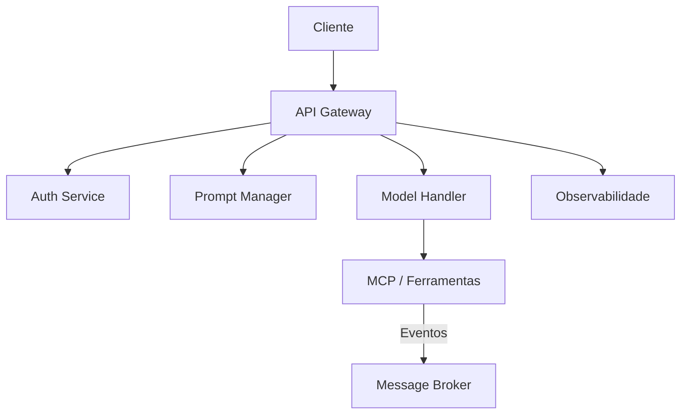
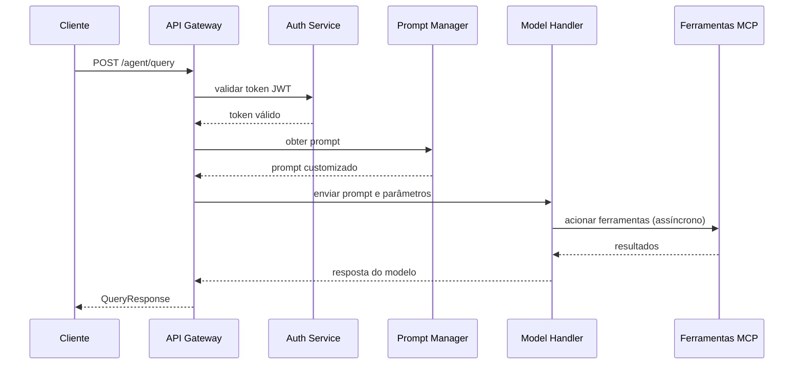

# Arquitetura do MVP-Agent

## Sumário
- [Visão Geral](#visao-geral)
- [Componentes Principais](#componentes-principais)
- [Diagrama de Componentes](#diagrama-de-componentes)
- [Fluxo de Requisição](#fluxo-de-requisicao)
- [Tecnologias Sugeridas](#tecnologias-sugeridas)
- [Próximos Passos](#proximos-passos)

## Visão Geral
O projeto **MVP-Agent** oferece um agente de IA acessível por HTTP, com alta
flexibilidade de configuração de modelos, temperatura, prompts e ferramentas
integradas ao ecossistema MCP. Toda a solução segue boas práticas de
observabilidade, incluindo logs estruturados, métricas e tracing distribuído.

## Componentes Principais
1. **API Gateway (FastAPI)** – expõe os endpoints do agente e coordena as
   chamadas para autenticação, gerenciamento de prompts e execução do modelo.
2. **Auth Service** – valida tokens JWT com claims customizados e controla o
   acesso aos recursos.
3. **Prompt Manager** – armazena e distribui prompts personalizados conforme o
   contexto da requisição.
4. **Model Handler** – abstrai o provedor de IA (ex.: OpenAI, HuggingFace) e
   aplica parâmetros dinâmicos como temperatura e modelo.
5. **Tools/MCP Integration** – executa ferramentas externas (buscas, scripts,
   automações) via broker assíncrono.
6. **Message Broker** – orquestra tarefas em background e integra serviços de
   forma desacoplada (sugestão: Redis ou RabbitMQ).
7. **Observabilidade** – coleta logs, métricas (Prometheus) e tracing
   distribuído (OpenTelemetry) de todos os componentes.

## Diagrama de Componentes

## Fluxo de Requisição

## Tecnologias Sugeridas
- **FastAPI** para a camada HTTP devido à sua performance e tipagem.
- **Pydantic** para validação de payloads.
- **Redis** ou **RabbitMQ** como broker para filas assíncronas.
- **OpenTelemetry** para tracing distribuído e **Prometheus** para métricas.
- **Docker** para empacotamento e replicação do ambiente.

## Próximos Passos
- Definir schemas completos de autenticação e de mensagens do broker.
- Escrever testes automatizados para cada componente.
- Evoluir a integração com ferramentas MCP e outros modelos de IA.

Para detalhes dos endpoints e payloads, consulte a [Especificação da API](api-spec.md).
